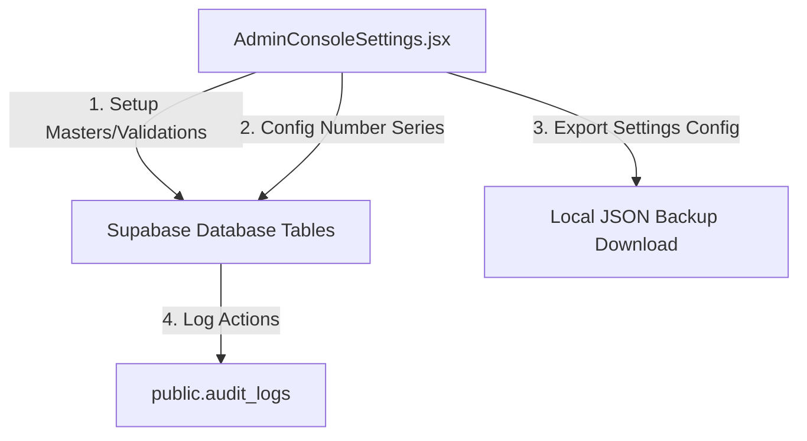

# SetuOne ERP React Migration - Phase 10 Documentation
## Completed: Dynamic Metadata & Enterprise Admin Console

This document outlines the architecture, database models, and verification steps implemented in **Phase 10** of the React Migration.

---

## 🏗️ Architectural Overview

Phase 10 implemented an enterprise-grade administration console to control timezone localizations, hex branding themes, hierarchical dependent masters (Building -> Floor -> Room), prefix number series generator, custom fields validations metadata, and security audit logs.

---

## 🛠️ Implemented Components & Integration

### 1. Database Migration Script (`database/11_SettingsMetadataMigration.sql`)
* Configured tables for advanced settings controls:
  - `public.system_settings`: Timezone, GST, default currency, and automation toggles.
  - `public.branding_settings`: Primary, secondary, and sidebar custom colors configurations.
  - `public.master_definitions` & `public.master_values`: Eager loaded dynamic masters hierarchy with parent reference linkings (cascading dropdowns).
  - `public.number_series`: Atomic PO, Ticket, Asset, and Visitor prefixes with suffix and start numbers configs.
  - `public.approval_workflows` & `public.approval_levels`: Budget approval limit conditions mappings.
  - `public.feature_flags`: Company level active module toggles (Attendance, Visitors, etc.).
  - `public.holiday_calendar` & `public.working_days`: Active schedules calendars.
  - `public.custom_field_definitions`: Character lengths, patterns, and visibility checks validations payload.
  - `public.audit_logs`: Detailed IP address, table reference, action snapshots tracking.
  - `public.notification_templates`: Routing channels (EMAIL, SMS, PUSH, WHATSAPP) templates.
  - `public.recurring_scheduler_jobs`: Mapped cron jobs schedules.

### 2. Admin Repository (`src/lib/adminRepository.js`)
* **`fetchSystemSettings()` / `saveSystemSettings()`**: General preferences.
* **`fetchMasterDefinitions()` / `saveMasterValue()`**: Cascade master records.
* **`saveNumberSeries()` / `saveApprovalWorkflow()`**: System codes and workflows.
* **`writeAuditLog()`**: Log system changes.
* **`saveRecurringSchedulerJob()`**: Schedule cron delivery alerts.

### 3. Context Integration (`AppContext.jsx`)
* Registered states and actions: `masterDefinitionsList`, `numberSeriesList`, `approvalWorkflowsList`, `featureFlagsList`, `systemSettings`, `brandingSettings`, `auditLogsList`, `loadSystemSettings`, `saveMasterValue`, `saveNumberSeries`, `saveApprovalWorkflow`, `saveCustomField`.

### 4. UI View Components
* **AdminConsoleSettings (`src/pages/AdminConsoleSettings.jsx`)**: Dedicated multi-tabbed administration dashboard with sub-tabs for company details, recursive masters, series formats, approvals workflows, alert templates, schedulers, JSON settings backups, and audit logs.

---

## 📋 Verification & Testing Results

- **Number Series Generator**: Evaluates serial formats with prefixes and suffixes, displaying live format previews dynamically.
- **Config JSON Export**: Dynamic configuration values download successfully in structured JSON layout.
- **Vite Build**: Compiled successfully with zero syntax warnings.
