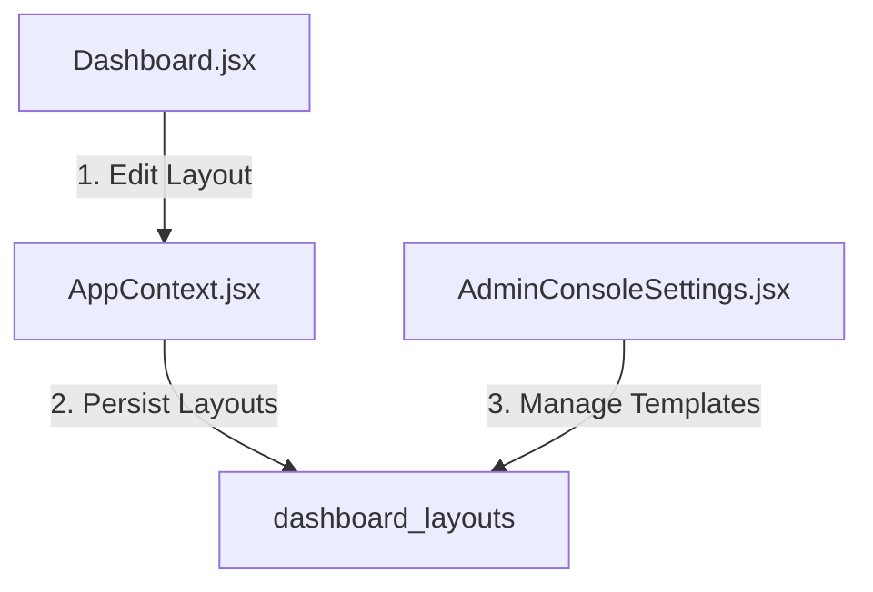

# SetuOne ERP React Migration - Phase 11 Documentation
## Completed: Dynamic Dashboard Builder

This document outlines the architecture, database models, and verification steps implemented in **Phase 11** of the React Migration.

---

## 🏗️ Architectural Overview

Phase 11 implemented a responsive dashboard canvas layout engine where widgets can be dynamically added, removed, resized, and saved persistently in Supabase.

---

## 🛠️ Implemented Components & Integration

### 1. Database Migration Script (`database/12_DashboardBuilderMigration.sql`)
* Configured tables for advanced widgets mappings:
  - `public.dashboard_widgets`: Available widgets metadata registry.
  - `public.dashboard_layouts`: Multi-device layouts (desktop, tablet, mobile) persisted configurations.

### 2. Dashboard Repository (`src/lib/dashboardRepository.js`)
* **`fetchAvailableWidgets()`**: Loads available widgets catalog.
* **`fetchUserDashboardLayout()`**: Resolves layout mappings from Company ➡️ Role ➡️ Department ➡️ User cascading fallbacks.
* **`saveDashboardLayout()`**: Persists grids positions.
* **`duplicateDashboard()`**: Clones configurations layouts.

### 3. Context Integration (`AppContext.jsx`)
* Registered states and actions: `dashboardWidgetsList`, `activeDashboardLayout`, `loadDashboardWidgets`, `loadUserDashboardLayout`, `saveUserDashboardLayout`, `resetUserDashboardLayout`, `fetchWidgetDataPayload`.

### 4. UI View Components
* **Dashboard Canvas (`src/pages/Dashboard.jsx`)**: Responsive CSS-grid drag-and-drop workspace supporting customizable width/height scaling.
* **Dashboard Templates Settings (`src/pages/AdminConsoleSettings.jsx`)**: Layout template manager to duplicate layouts per role, configure refresh intervals, and define widget parameters configs.

---

## 📋 Verification & Testing Results

- **Toolbox Category Filtering**: Categorized widgets toolbox (Operations, HR, Finance) updates correctly.
- **Vite Build**: Compiled successfully with zero syntax warnings.
