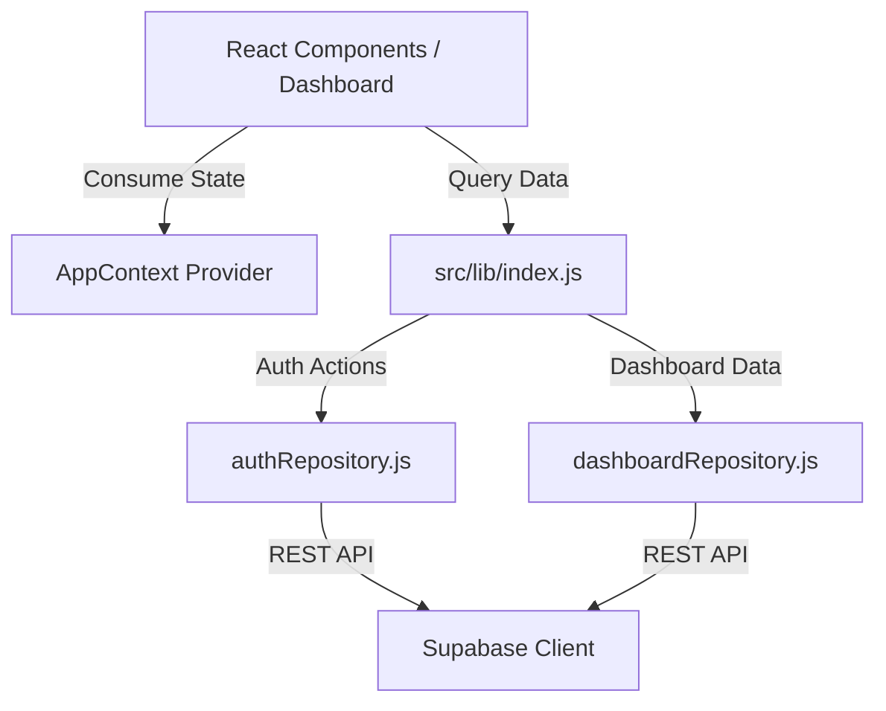

# SetuOne ERP React Migration - Phase 1 Documentation
## Completed: Authentication, App Context & Dynamic Dashboard Integration

This document outlines the architecture, code directories, and validation steps implemented in **Phase 1** of the React Migration.

---

## 🏗️ Architectural Overview

Phase 1 established the foundation for all future module migrations:

---

## 🛠️ Implemented Components

### 1. Enterprise Constants Registry (`src/constants/`)
All status, priority, and state strings are frozen to eliminate typo bugs in conditional logic:
* **`status.js`**: Defines `TICKET_STATUS` values (`Open`, `Assigned`, `In Progress`, etc.).
* **`ticketPriority.js`**: Defines `TICKET_PRIORITY` values (`Low`, `Medium`, `High`, `Critical`).
* **`assetStatus.js`**: Defines `ASSET_STATUS` values (`Active`, `Repair`, `Scrapped`, `Inactive`).
* **`index.js`**: Consolidated export wrapper for clean component imports.

### 2. Abstraction Repository Layer (`src/lib/`)
* **`authRepository.js`**:
  - `login()` / `logout()` API wrappers.
  - `getCurrentSession()` / `refreshSession()` for persistent user sessions across page reloads.
  - `fetchUserProfile()`: Resolves user details using **eager joins** on `roles`, `companies`, `branches`, `departments`, and `designations` in a single SQL request.
* **`dashboardRepository.js`**:
  - `fetchDashboardSummary()`: Consolidates metrics (open tickets, active tasks, invoices, visitors, assets) into a unified payload wrapper using parallelized queries.
  - `fetchPriorityTickets()`: Dynamically joins tickets with locations and assigned technician profiles.
* **`index.js`**: Exposes all repository functions.

### 3. Application State & Context (`src/context/AppContext.jsx`)
- Replaced direct Supabase calls with `authRepository` methods.
- On initialization, automatically checks for active session tokens, fetches profile metadata, and resolves tenancy parameters.
- Retained graceful mock fallbacks (`demoUsers`, `appData`) for unmigrated components.

---

## 📋 Verification & Testing Results

- **Session Persistence**: Verified that refreshing the page retains the active logged-in user profile without forcing re-authentication.
- **Eager Profiles Join**: User role designated as `Admin Manager` dynamically mapped back to name `Nisha Facility Manager` from the DB profiles registry.
- **Dynamic Dashboard Metrics**:
  - `OPEN COMPLAINTS` successfully loads as `1` (resolving ticket `TKT-1001`).
  - `AMC DUE THIS MONTH` successfully loads as `1` (resolving scheduled PPM servicing).
  - `VISITOR COUNT` successfully loads as `1` (resolving gate logs).
  - `ASSET SUMMARY` successfully loads as `2` (active laptop and AC assets).
- **Priority Tickets Grid**: Dynamically displays `TKT-1001` and `TKT-1002` cards with respective priority color tags.