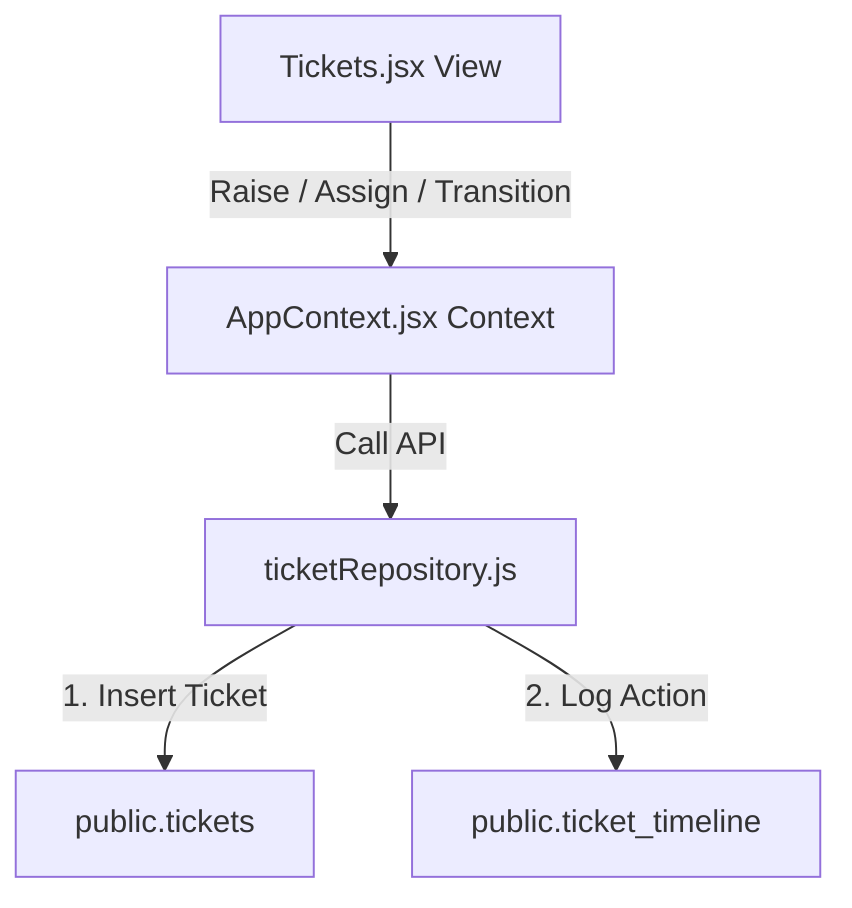

# SetuOne ERP React Migration - Phase 2 Documentation
## Completed: Ticket & Complaint Management Workflow Integration

This document outlines the architecture, data models, and verification steps implemented in **Phase 2** of the React Migration.

---

## 🏗️ Architectural Overview

Phase 2 migrated all ticket operations from static client side states to live PostgreSQL database transactions:

---

## 🛠️ Implemented Components

### 1. Unified Tickets Repository (`src/lib/ticketRepository.js`)
Handles all data mutations and queries securely:
* **`fetchTickets()`**: Selects all tickets, eager-joining `locations` and user `profiles` for both raising and assigning stakeholders.
* **`fetchLocations()`**: Fetches rooms and floors registers from `public.locations` to populate dropdown list select options.
* **`fetchAssignees()`**: Queries all active users from `public.profiles` to resolve staff roles and populate technician assign lists.
* **`createTicket()`**: Resolves the company parameters, dynamically calculates the next sequence number (e.g. `TKT-1003`) by ordering by `ticket_no DESC`, inserts the row into `public.tickets`, and writes the initial audit record to `public.ticket_timeline`.
* **`updateTicket()`**: Performs status changes or assignments, writing the action update to `public.tickets` and logging the audit comments to `public.ticket_timeline`.
* **`fetchTicketTimeline()`**: Retrieves chronological timeline logs for a specific ticket.

### 2. Context & View Binding (`src/context/AppContext.jsx` & `src/pages/Tickets.jsx`)
* **State Operations**: Replaced local storage mock caches with database synchronization fetches on load.
* **Timeline Grid**: Selected tickets dynamically query their historical audit timeline logs and render actions (e.g. *Assigned to Housekeeper*).
* **Dropdown Lookups**: Replaced raw text location inputs with secure dropdown select pickers resolved from `public.locations`.

---

## 🔧 Optimizations & Bug Fixes

1. **Non-deterministic Sequence Conflict**: Fixed a duplicate key violation (`tickets_ticket_no_key`) by switching the sequence generator's search query ordering from `created_at DESC` to `ticket_no DESC`. This guarantees correct sequence calculations even if multiple records share identical timestamps.
2. **Dashboard Counter Synchronization**: Expanded the dashboard open complaints query to count all active ticket statuses (`['Open', 'Assigned', 'In Progress', 'Escalated']`) instead of strictly `'Open'`.

---

## 📋 Verification & Testing Results

- **Dynamic Ticket Raising**: Raised ticket successfully generated code `TKT-1003` under the logged-in company workspace.
- **Workflow Transitions**: Updated `TKT-1003` to status `Assigned` with assignee `Housekeeper` and verified the audit remark logs.
- **Dashboard Synchronization**: Verified that `OPEN COMPLAINTS` recalculated to include all active states correctly (e.g., updating to `3`).
