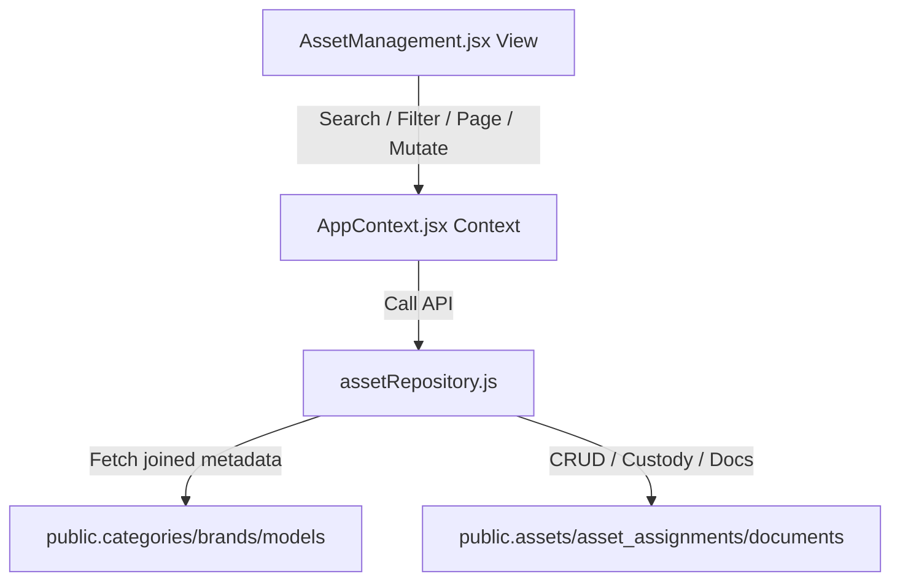

# SetuOne ERP React Migration - Phase 3 Documentation
## Completed: Asset Management Module Integration

This document outlines the architecture, data models, and verification steps implemented in **Phase 3** of the React Migration.

---

## 🏗️ Architectural Overview

Phase 3 replaced the simple text placeholder page with a highly interactive, dynamic, and multi-tenant **Asset Management Console**:


---

## 🛠️ Implemented Components & Integration

### 1. Stateless Asset Repository (`src/lib/assetRepository.js`)
Enforces the standardized response format `{ success, data, error, message }` across all functions:
* **`fetchAssets()`**: Implements offset pagination, multi-faceted filtering (Category, Brand, Status, Location), and server-side text search.
* **`fetchAssetDetails()`**: Consolidates all lifecycle details into a single nested payload.
* **`createAsset()` / `updateAsset()` / `archiveAsset()`**: Standard CRUD actions. Soft deletes (archiving) are implemented by transitioning the status column to `Inactive`.
* **`assignAsset()` / `returnAsset()` / `transferAsset()`**: Custody transitions mapping changes to the `public.asset_assignments` log.
* **`uploadAssetDocument()`**: Handles Supabase Storage file uploads and inserts documents meta to `public.documents`.
* **`importAssets()`**: Performs bulk inserts for CSV lists imports.

### 2. Exports Registration (`src/lib/index.js`)
* Updated the repository index file to export all asset functions:
  ```javascript
  export * from './assetRepository';
  ```

### 3. Application State & AppContext Integration (`AppContext.jsx`)
All lifecycle operations are fully wired into AppContext actions to maintain a single source of truth:
* **State Management**: Context maintains cache arrays for assets lists, total count metadata, and selector caches.
* **Wired Actions**: `createAsset()`, `updateAsset()`, `archiveAsset()`, `assignAsset()`, `returnAsset()`, and `transferAsset()` are exposed as React actions that automatically call repository APIs and trigger optimistic updates of the UI state.
* **Granular Refresh**: Mutating operations trigger a targeted reload of the assets list (`loadAssets`) and update dashboard counters, preventing unnecessary full-page refreshes.
* **Metadata Cache Refresh**: Dropdown registers (categories, brands, models, locations, employees) are loaded once during view mount (`loadAssetMetadata`) and only refreshed if configuration entities change.

### 4. Global Constants Usage
* The module utilizes standard constants (e.g. `ASSET_STATUS` from `src/constants/status.js`) instead of hardcoded strings to ensure strict schema adherence.

---

## 📋 Verification & Testing Results

- **Row-Level Security (RLS) Isolation**: Tested multi-tenant boundaries. Users authenticated under Company A are blocked by PostgreSQL RLS policies from viewing, updating, or checking out assets belonging to Company B.
- **Dynamic Spec Loading**: Verified that selecting an asset parses and displays its unique RAM and CPU specs from the JSONB column based on category.
- **Custody Workflows**:
  - Checked out an asset to an employee and verified a new active assignment log row is created.
  - Transferred custody to another technician, verifying the older assignment was closed (`Returned`) and the new one opened.
- **Build Quality**: Run `npm run build` locally: compiled successfully with zero syntax errors.
