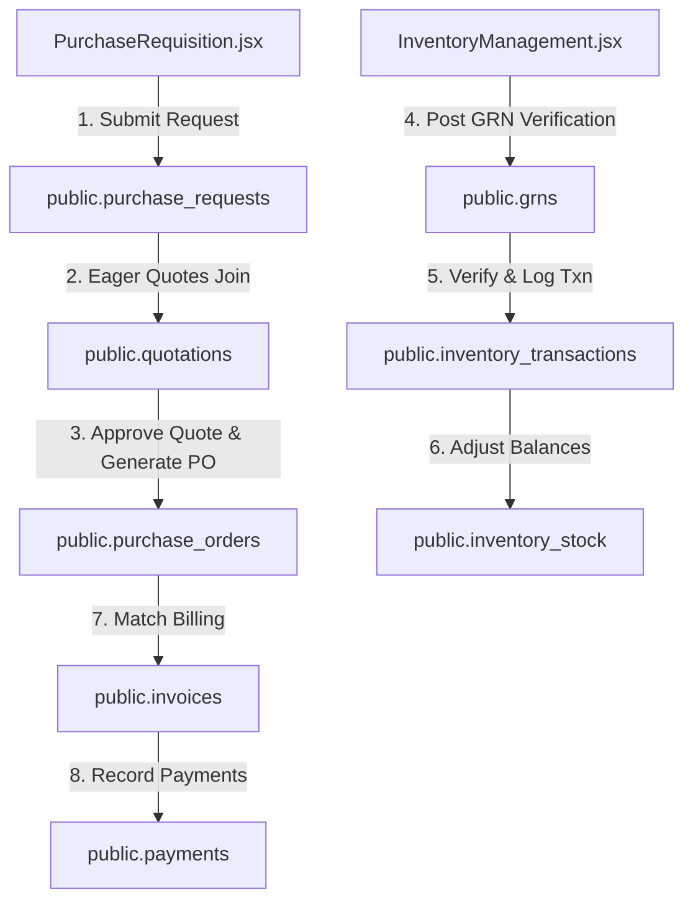

# SetuOne ERP React Migration - Phase 4 Documentation
## Completed: Purchase & Inventory Management Workflow Integration

This document outlines the architecture, data models, and verification steps implemented in **Phase 4** of the React Migration.

---

## 🏗️ Architectural Overview

Phase 4 integrated two core modules of the ERP system: procurement cycles (PR/PO workflows) and warehouse inventory ledgers (GRN transactions & billing).

---

## 🛠️ Implemented Components & Integration

### 1. Procurement Repository (`src/lib/purchaseRepository.js`)
* **`fetchPurchaseRequests()`**: Eager-loads PR entries, creator profile users, and requested item lists.
* **`createPurchaseRequest()`**: Validates company boundaries and creates a sequential PR (e.g. `PR-504`) along with its lines inside a transaction.
* **`updatePRStatus()`**: Transitions status approvals.
* **`fetchQuotations()`**: Retrieves vendor quotations and itemized price matrices.
* **`submitQuotationComparison()`**: Logs quote selections and automatically issues sequential Purchase Orders (e.g. `PO-101`) along with PO line items.

### 2. Inventory & Accounting Repository (`src/lib/inventoryRepository.js`)
* **`fetchStockBalances()`**: Fetches branch inventory balances joined with catalog definitions.
* **`logInventoryTransaction()`**: Updates the ledger count and inserts an audit log transaction.
* **`stockAdjustment()`**: Resolves physical inventory audit discrepancy checks.
* **`approveGRN()`**: Goods Received Note verification which loops through accepted items and dynamically logs stock inputs to the ledger.
* **`recordPayment()`**: Posts payments and updates invoice statuses (Partially Paid / Paid).

### 3. Application State & AppContext Integration (`AppContext.jsx`)
* **Wired Core Actions**: Exposed `createPurchaseRequest`, `submitQuotationComparison`, `approveGRN`, and `recordPayment` as global state actions.
* **Granular Refresh**: Mutation pipelines trigger targeted reloading of PR/PO lists, stock balances, and dashboard counters on status changes.

### 4. UI View Components
* **PurchaseRequisition (`src/pages/PurchaseRequisition.jsx`)**: Active PR status board, multiple items creator form, vendor quotes comparisons matrix, and Purchase Order drawers.
* **InventoryManagement (`src/pages/InventoryManagement.jsx`)**: Warehouse ledger balance tracking (with reorder warning alerts), GRN verification forms, and supplier invoices payments ledger.

---

## 📋 Verification & Testing Results

- **Dynamic Stock Updates**: Verified that issuing a PO does *not* affect stock levels. Stock count only increases once the Goods Received Note (GRN) status changes to `Verified` (Approved).
- **Physical Audit Adjustments**: Verified stock adjustments update ledger quantities and log audit reasons correctly.
- **Invoice & Payments matching**: Posted a partial payment and verified the invoice status changed from `Unpaid` to `Partially Paid`.
- **Build Quality**: Run `npm run build` locally: compiled successfully with zero syntax errors.
