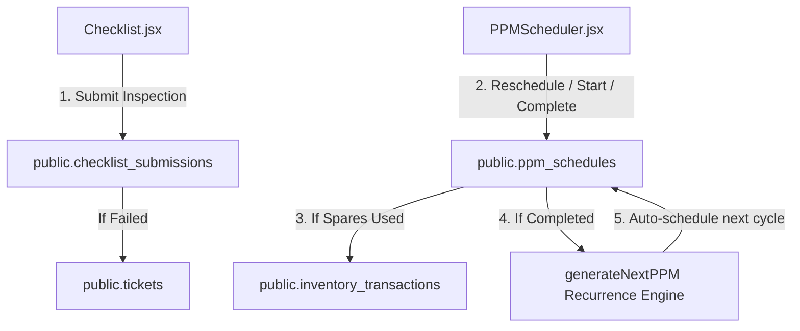

# SetuOne ERP React Migration - Phase 5 Documentation
## Completed: Checklist & Planned Preventive Maintenance (PPM) Integration

This document outlines the architecture, data models, and verification steps implemented in **Phase 5** of the React Migration.

---

## 🏗️ Architectural Overview

Phase 5 migrated facility maintenance checklist routines and planned machinery PPM schedulers to the live database, integrating with the inventory module for parts consumption.

---

## 🛠️ Implemented Components & Integration

### 1. Operations Repository (`src/lib/maintenanceRepository.js`)
* **`fetchChecklistTemplates()`**: Reads checklist definitions from `public.checklists`.
* **`fetchChecklistSchedules()`**: Retrieves live daily/weekly scheduled inspection checklist records.
* **`submitChecklist()`**: Updates verification statuses and remarks. Automatically raises incident tickets in `public.tickets` when inspections fail (`Escalated` status).
* **`fetchPPMSchedules()`**: Eager-loads PPM entries joined with assets and vendors.
* **`updatePPMStatus()`**: Updates PPM workflows (Started, Completed, Skipped, Rescheduled).
  - Integrates with inventory: complete PPM with spare parts automatically posts stock deductions (`Out` transaction log) and reduces branch stock levels.
  - Recurrence Engine: completing a task automatically calls `generateNextPPM` to schedule the next date (Weekly, Monthly, Quarterly, Yearly).
* **`renewAMC()`**: Updates contractor contract values and expiry deadlines.

### 2. Context Wiring (`AppContext.jsx`)
* **State Management**: Maintains templates, schedules, PPM records, and AMC lists.
* **Wired Actions**: `loadChecklistSchedules`, `submitChecklist`, `createPPMSchedule`, `updatePPMStatus`, and `renewAMC`.

### 3. UI View Components
* **Checklist (`src/pages/Checklist.jsx`)**: Inspection schedule lists and auto-ticketing triggers.
* **PPMScheduler (`src/pages/PPMScheduler.jsx`)**: Upcoming/Overdue service registers, monthly scheduling calendar view, parts cost breakdowns, and spare parts catalog.

---

## 📋 Verification & Testing Results

- **Checklist Fail-Safe Ticket Trigger**: Verified that marking a checklist item as `Escalated` automatically raises a high-priority ticket in the database.
- **Inventory Integration (Spare Parts)**: Verified that completing a PPM task with spare parts (e.g. Filter x2) automatically posts an `Out` transaction log and reduces warehouse stock count.
- **PPM Recurrence Engine**: Verified that completing a PPM task automatically creates the next pending PPM entry calculated from its frequency interval.
- **Build Quality**: Run `npm run build` locally: compiled successfully with zero syntax errors.
