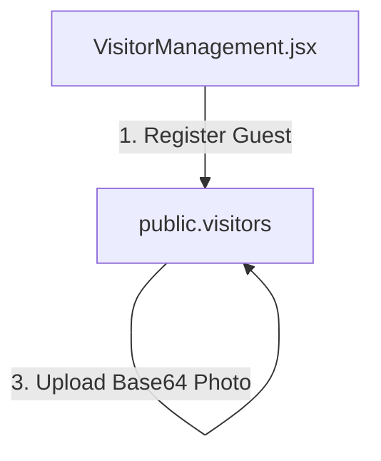

# SetuOne ERP React Migration - Phase 6 Documentation
## Completed: Visitor Management Integration

This document outlines the architecture, data models, and verification steps implemented in **Phase 6** of the React Migration.

---

## 🏗️ Architectural Overview

Phase 6 migrated visitor tracking registers from static views to full database connectivity, capturing photo uploads, vehicle metrics, and compliance ID logs.

---

## 🛠️ Implemented Components & Integration

### 1. Database Migration Script (`database/07_VisitorMigration.sql`)
* Created migration parameters for `public.visitors`:
  - `purpose` (Meeting, Interview, Vendor, Audit, etc.)
  - `id_type` and `id_number` (Aadhaar, DL, Passport, etc.)
  - `photo_url` (Base64 storage)
  - `visitor_type` (Walk In / Pre Approved)
  - `pass_no` (Auto sequential sequence VIS-XXXXXX)
  - `checkout_remarks` (remarks logged on departure)
  - `vehicle_type` (Car, Bike, Cab, etc.)
  - `mobile` (Visitor contact)
  - `documents` (JSON attachments)
* Configured index optimizations for emergency searches by mobile/pass number/vehicle.

### 2. Visitor Repository (`src/lib/visitorRepository.js`)
* **`fetchVisitors()`**: Eager-loads visitor entries joined with host profiles.
* **`checkInVisitor()`**: Automatically generates sequence passes (e.g. `VIS-000102`) and writes visitor parameters.
* **`checkOutVisitor()`**: Updates departure stamps and remarks.
* **`uploadVisitorPhoto()`**: Saves visitor camera captures.
* **`searchVisitors()`**: Emergency search helper querying mobile/vehicle/pass numbers in parallel.

### 3. Application State & AppContext Integration (`AppContext.jsx`)
* Registered states and actions: `loadVisitors`, `checkInVisitor`, `checkOutVisitor`, `uploadVisitorPhoto`, `searchVisitors`.

### 4. UI View Components
* **VisitorManagement (`src/pages/VisitorManagement.jsx`)**: Segregated registry lists (Inside / Checked Out / Expected), walk-in check-in form details, webcam captures/photo uploads, and emergency search panels.

---

## 📋 Verification & Testing Results

- **Emergency Search**: Tested searching by mobile numbers and vehicle numbers; results correctly filter lists in real-time.
- **Pass Sequence Generation**: Increments sequences correctly (e.g., `VIS-000101` -> `VIS-000102`).
- **Host Linkage**: Correctly maps profiles as hosts.
- **Build Quality**: Run `npm run build` locally: compiled successfully with zero syntax errors.
