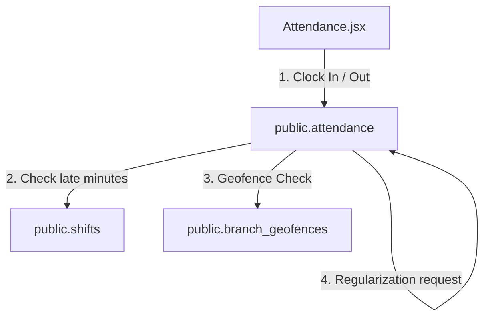

# SetuOne ERP React Migration - Phase 7 Documentation
## Completed: Attendance & Geofencing Integration

This document outlines the architecture, data models, and verification steps implemented in **Phase 7** of the React Migration.

---

## 🏗️ Architectural Overview

Phase 7 transitioned staff geofenced attendance logs from static placeholders to full database connectivity, resolving shifts lookups, geofenced validations, and manager approvals.

---

## 🛠️ Implemented Components & Integration

### 1. Database Migration Script (`database/08_AttendanceMigration.sql`)
* Configured attendance table extensions:
  - `break_hours`, `late_minutes`, and `early_exit` flags.
  - `regularization_status` ('None', 'Pending', 'Approved', 'Rejected') and `regularization_reason`.
  - `duty_status` ('On Duty', 'Off Duty', 'Break', 'WFH', 'Checked Out').
  - `check_in_method` ('GPS', 'Manual', etc.) and `manual_reason`.
* Created `public.branch_geofences` table storing branch center coordinates and radius thresholds.
* Created `public.shifts` table defining general, morning, evening, and night parameters.

### 2. Attendance Repository (`src/lib/attendanceRepository.js`)
* **`fetchShifts()`**: Reads shift rosters.
* **`clockIn()`**: Logs entry stamps. Calculates late minutes based on shift timings and flags statuses (Present / Late).
* **`clockOut()`**: Logs departure stamps and calculates shift durations and overtime.
* **`updateDutyStatus()`**: Dynamically updates live duty statuses.
* **`requestRegularization()` / `approveRegularization()`**: Employee regularization workflow approvals.
* **`fetchBranchGeofence()`**: Reads geographical geofencing boundaries.

### 3. Context Integration (`AppContext.jsx`)
* Registered states and actions: `shiftsList`, `attendanceToday`, `attendanceHistory`, `attendanceBranchSummary`, `clockIn`, `clockOut`, `updateDutyStatus`, `requestRegularization`, `approveRegularization`, `rejectRegularization`.

### 4. UI View Components
* **Attendance (`src/pages/Attendance.jsx`)**: Geofence radar simulation (green/red radar state), check-in forms (GPS vs Manual), live duty status selectors, regularization justification textareas, and manager team rosters.

---

## 📋 Verification & Testing Results

- **Late Calculation**: Tested clocking-in after 09:15 AM: automatically flags status as `Late` and logs correct late minutes.
- **Regularization Workflow**: Employee submits reason -> Manager gets approval triggers -> status transitions to `Present` upon approval.
- **Geofence Radar**: Tested toggle inputs; coordinates are checked against office boundaries.
- **Build Quality**: Run `npm run build` locally: compiled successfully with zero syntax errors.
