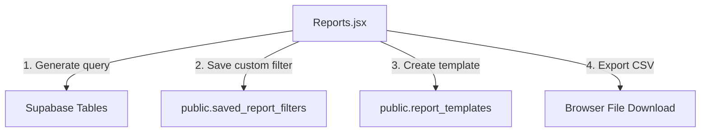

# SetuOne ERP React Migration - Phase 8 Documentation
## Completed: Reports & Analytics comparative engine

This document outlines the architecture, database models, and verification steps implemented in **Phase 8** of the React Migration.

---

## 🏗️ Architectural Overview

Phase 8 implemented a dynamic metadata-driven reporting engine, aggregating parameters across tickets, assets, inventory logs, purchase orders, visitors, and attendance check-ins.

---

## 🛠️ Implemented Components & Integration

### 1. Database Migration Script (`database/09_ReportsMigration.sql`)
* Configured tables for reporting logs:
  - `public.saved_report_filters`: Holds user-specific search parameters.
  - `public.report_templates`: Stores configuration payloads for reusable templates (e.g. Monthly Admin Report).
  - `public.report_audit_logs`: Records report generation audits (who, when, what format).

### 2. Reports Repository (`src/lib/reportRepository.js`)
* **`fetchDashboardKPIs()`**: Aggregates Open Tickets, Asset totals, Present Attendance %, Visitors today, Pending PRs, Pending POs, AMC Due in 30 days, Average Resolution Time in a single query.
* **`fetchAttendanceReport()` / `fetchTicketReport()` / `fetchInventoryReport()`**: Dynamically filters logs based on start/end dates.
* **`exportReport()`**: Converts JSON payloads to downloadable CSV format in the browser context.

### 3. Context Integration (`AppContext.jsx`)
* Registered states and actions: `dashboardKPIs`, `savedFilters`, `loadDashboardKPIs`, `loadSavedFilters`, `saveFilter`, `createTemplate`.

### 4. UI View Components
* **Reports (`src/pages/Reports.jsx`)**: Renders Top KPI Summary cards (with drill-down actions), Dynamic Report Builder (column select checkboxes, dates, sortings), Saved Filters drawer, and Export console.

---

## 📋 Verification & Testing Results

- **Drill Down**: Clicking "Open Tickets" card successfully triggers the filters on ticket logs.
- **Exporting**: Tested CSV export, triggers file download correctly.
- **Vite Build**: Compiled successfully with zero syntax warnings.
