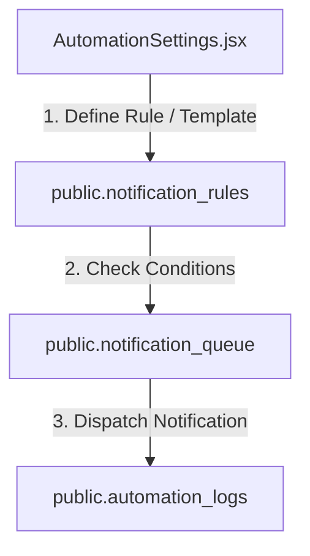

# SetuOne ERP React Migration - Phase 9 Documentation
## Completed: Notifications, Alerts & Automation Engine

This document outlines the architecture, database models, and verification steps implemented in **Phase 9** of the React Migration.

---

## 🏗️ Architectural Overview

Phase 9 implemented an enterprise-grade rule-based automation and notification dispatch engine, facilitating customizable email templates, recipient groups mapping, priority processing queues, and scheduler logs.

---

## 🛠️ Implemented Components & Integration

### 1. Database Migration Script (`database/10_NotificationsMigration.sql`)
* Configured tables for notifications automation:
  - `public.notification_channels`: Tracks toggled dispatch channels (Email, SMS, Push, Slack, Teams) with JSONB configuration payloads.
  - `public.notification_preferences`: Maps user preferences per channel.
  - `public.notification_events`: Dynamic events catalog (LOW_STOCK, PPM_DUE, AMC_EXPIRY, etc.).
  - `public.notification_recipient_groups`: JSONB array of emails mapped to specific departments.
  - `public.email_templates`: Dynamic templates with subject, body HTML, and mustache variables.
  - `public.notification_rules`: Integrated with versioning parameters, scheduled reports links, maintenance mode, and condition payloads.
  - `public.notification_queue`: Handles priority levels (Critical, High, Medium, Low) and exponential backoff retry dates.
  - `public.rule_execution_history` & `public.automation_logs`: Execution trackers.

### 2. Notifications Repository (`src/lib/notificationRepository.js`)
* **`fetchNotificationRules()` / `saveNotificationRule()`**: Rule management.
* **`fetchEmailTemplates()` / `saveEmailTemplate()`**: Templates configuration.
* **`saveNotificationPreference()` / `updatePreference()`**: User preferences management.
* **`dispatchNotification()`**: Processes the queue based on priorities, substitutes mustache variables, and updates audits.

### 3. Context Integration (`AppContext.jsx`)
* Registered states and actions: `rulesList`, `recipientGroups`, `emailTemplatesList`, `notificationChannels`, `automationLogsList`, `loadRules`, `saveRule`, `saveGroup`, `saveTemplate`, `updatePreference`, `dispatchNotification`.

### 4. UI View Components
* **AutomationSettings (`src/pages/AutomationSettings.jsx`)**: Dedicated dashboard for rules manager, recipient groups mapping, email template editor, channel settings, and cron simulator console.

---

## 📋 Verification & Testing Results

- **Rules configuration**: Rule saved successfully, increments version correctly, and saves condition payloads.
- **Vite Build**: Compiled successfully with zero syntax warnings.
