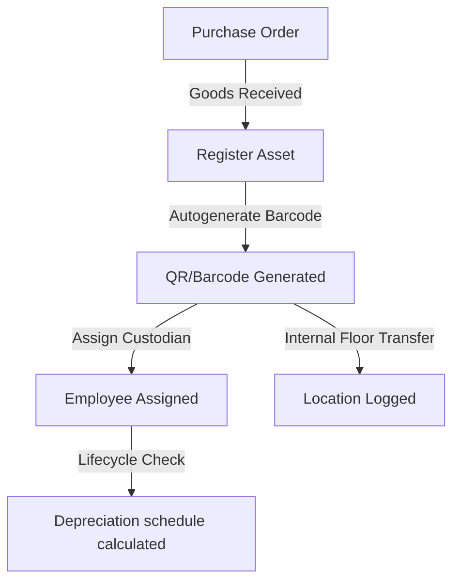
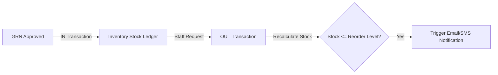
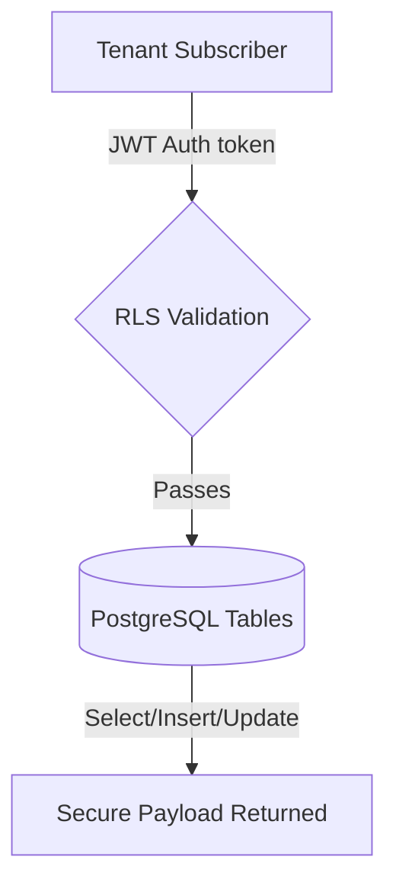

# SetuOne Integrated Facility ERP - Client Presentation Slides
*A Professional, Client-Ready Deck Outlining Features, Value Proposition, Technical Flowcharts, and ROI*

---

````carousel
# Slide 1: Welcome to SetuOne ERP
### Next-Gen Integrated Facility & Resource Management
* **The Mission**: Centralize and automate corporate operations.
* **Unified Workspace**: 4 Core modules (Asset Management, Inventory, IT Assets, and Facility Assets) running on a single dashboard.
* **Enterprise Security**: Multi-tenant security isolation keeping your business branches protected.


<!-- slide -->
# Slide 2: The Core Problem & Our Solution
### Streamlining Disconnected Workflows

| Disconnected Operations (Before) | Unified SetuOne ERP (After) |
|---|---|
| Manual excel tracking for laptops, SIMs, and furniture | Dynamic Asset Register with custom sequential barcodes |
| Consumable stock deficits (Coffee, HK, Stationery) | Real-time Inventory Transactions with low stock alerts |
| Hard-to-audit check-ins & paper visitors register | Geo-fenced Security logs and QR badge visitor checks |
| Missed AMC warranty checks & high repair costs | Preventive Maintenance Schedules with automated AMC alerts |

<!-- slide -->
# Slide 3: Unified Navigation Tree (UX Aesthetics)
### High-Fidelity Responsive Hover Controls
* **One App Launcher**: Switch between apps with a modern 9-dot grid launcher.
* **Asset Hub**: Exactly one single horizontal navigation hub featuring 4 primary sections:
  1. **`Asset Management`**: The centralized control registry dashboard.
  2. **`Inventory`**: Tracking consumables (Tea/Coffee, Housekeeping, Stationery).
  3. **`IT Assets`**: Hover-triggered dropdown (*Mobile, SIM, Laptop, Desktop, Monitor, Printer, CCTV*).
  4. **`Facility Assets`**: Hover-triggered dropdown (*HVAC, Electrical, Machinery, Furniture, Vehicles, Safety*).
* **Hover Micro-Animations**: Navigation links expand dynamically with scaling sky-blue hover bullets for smooth interaction.
<!-- slide -->
# Slide 4: Real-time Asset Tracking & Barcodes
### From Purchase Order to Allocations



* **Automated Barcodes**: Every registered asset receives a unique sequential barcode for quick scanning.
* **Floor Transfers**: Log internal building movements to keep locations updated.
* **Depreciation Sheet**: Automatic Straight Line Method (SLM) and WDV calculations.
<!-- slide -->
# Slide 5: Real-Time Consumables Audit
### Eliminating Shortages in the Workplace
* **Dual Inventory Transaction Log**: Track items coming `IN` from procurement and items going `OUT` as they are consumed by staff.
* **Automated Reorder Alerts**: Triggers low-stock alerts when key items fall below predefined thresholds.
* **Categorized Auditing**:



<!-- slide -->
# Slide 6: Database Architecture & Multi-Tenancy
### Security First Design with Supabase
* **Tenant Isolation**: Strict Row-Level Security (RLS) ensures that companies (like Orion Parks and Greenfield School) are securely separated.
* **System Schemas**:



* **Relational Security**: Strict foreign key cascades across `tenants`, `companies`, `branches`, `buildings`, `locations`, `assets`, and `inventory_stock`.
<!-- slide -->
# Slide 7: Value Proposition & Client ROI
### Measuring Success & Savings
* **60% Reduction in Audit Time**: Autogenerated barcodes make scanner checks lightning fast.
* **Zero Stock Deficits**: Reorder automation keeps coffee, housekeeping, and paper supplies stocked.
* **Prolonged Asset Lifespan**: AMC alerts and PPM schedules prevent breakdown repair costs.
* **Compliance Ready**: Multi-tenant RBAC tables keep security logs protected and audit-proof.
````

---

*SetuOne ERP - Ready to present to your stakeholders.*
