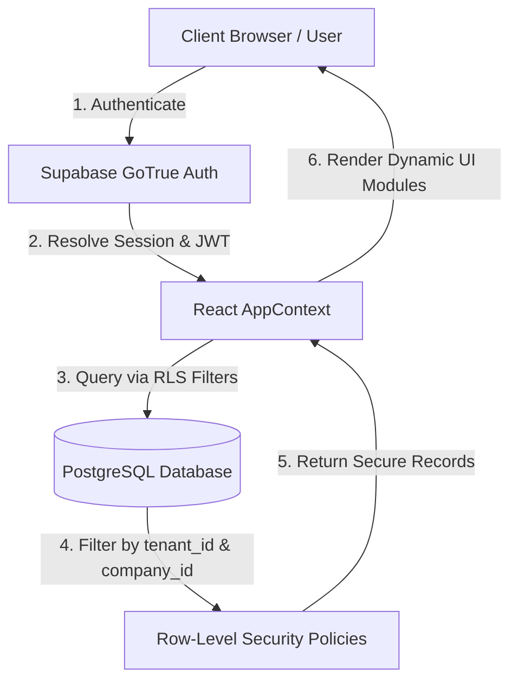
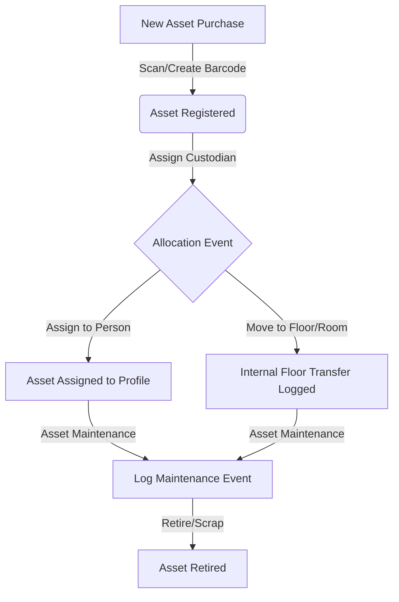
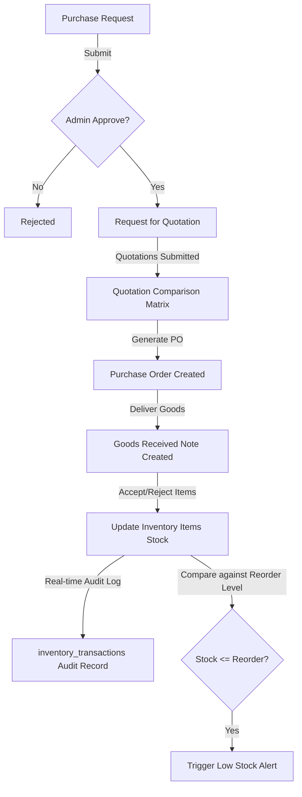
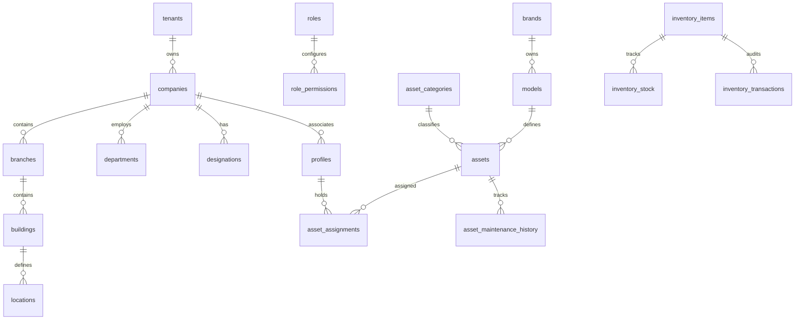

# SetuOne Integrated Facility ERP - Comprehensive Technical Report
*A Professional Blue-Ribbon Document on System Architecture, Database Schema, Relationships, and Data Flows for Client-Side Review*

---

## 1. Executive Summary & Core Stack
SetuOne is an enterprise-grade Integrated Facility and Asset Lifecycle Resource Planning (ERP) platform. It provides dynamic multi-tenant workspace isolation, role-based access control (RBAC), planned preventive maintenance, asset tracking with custom barcodes, real-time consumable inventory audits, visitor logs, and automated notification triggers.

### Technology Stack
* **Frontend**: React 19, Vite, TailwindCSS (optional), Vanilla CSS (premium custom tokens), React Hooks
* **Backend**: Supabase (PostgreSQL 15 Database, Row-Level Security, GoTrue Authentication)
* **API Layer**: Normalized repositories executing asynchronous transactional PostgreSQL calls
* **Integration**: Barcode processing, CSV Import/Export, OCR Energy meter ingestion engine

---

## 2. System Architecture & Flowcharts
The system operates as a secured multi-tenant database. Every profile belongs to a `company_id` and a `tenant_id`.



### Core Business Workflows

#### A. Asset Lifecycle & Assignment Flow


#### B. Procurement (PO) to Inventory Transaction Flow


---

## 3. Database Schema & Relationships (ERD)

The database is divided into 5 logical modules, each enforcing Row-Level Security (RLS) policies.



### Database Tables Dictionary & Roles

#### A. System Setup & Tenants (`01_Master.sql`)
1. **`tenants`**: Individual subscriber organizations. Maps billing/slug scopes.
2. **`companies`**: Sub-companies under the tenant (e.g. Orion Parks, Greenfield School).
3. **`branches`**: Physical regional offices or campuses belonging to a company.
4. **`buildings`**: Structures located inside a branch.
5. **`locations`**: Hierarchical spaces inside buildings (Floor, Room, Cabin, Zone).
6. **`departments`**: Divisions of work (IT, Admin, HR).
7. **`designations`**: Employee designations.
8. **`roles`**: RBAC user roles (Super Admin, Facility Manager, Executive, Staff).
9. **`modules`**: Registered application components (assets, inventory, tickets, visitors).
10. **`role_permissions`**: Matrix table mapping `role_id` to `module_id` permissions (`can_read`, `can_write`).
11. **`profiles`**: Master user ledger linked to Supabase's `auth.users(id)` containing profile metadata.

#### B. Asset Registry (`02_Assets.sql`)
1. **`asset_categories`**: Types of assets (e.g., Mobile, SIM, Laptop, HVAC, Furniture). Contains a `division` column (`IT Assets` or `Facility Assets`).
2. **`brands`**: Manufacturers of equipment (Apple, Dell, Daikin).
3. **`models`**: Specific equipment model lines.
4. **`assets`**: The core asset directory. Stores `barcode`, `serial_no`, `purchase_cost`, `depreciation_rate`, `status`, and `attributes` JSONB payloads.
5. **`asset_assignments`**: Real-time log of allocations (linked to employee `profiles` or building `locations`).
6. **`asset_maintenance_history`**: Maintenance logs, repairs, breakdown reports, and resolution costs.

#### C. Procurement & Consumables (`04_Purchase.sql`)
1. **`purchase_requests`**: Requests for new procurement actions.
2. **`purchase_request_items`**: Line items detailing requested products and estimated amounts.
3. **`quotations`**: Bid entries submitted by vendors.
4. **`quotation_comparisons`**: Dynamic matrices comparing vendor bids side-by-side.
5. **`purchase_orders`**: Procurement agreements sent to vendor.
6. **`grns`**: Goods Received Notes logging actual items accepted.
7. **`inventory_items`**: Master list of consumables (tea bags, stationery, cleaning liquids).
8. **`inventory_stock`**: Current stock balance per item and branch.
9. **`inventory_transactions`**: Real-time audit log tracking stock movement (`IN` from GRN, `OUT` for consumption).

---

## 4. API Mappings & JavaScript Repositories

The frontend uses structured repositories to communicate with the database via Supabase client scripts.

### 1. `assetRepository.js`
* **`fetchAssetMetadata()`**: Returns available brands, categories, models, and locations to populate dropdown selectors.
* **`fetchAssets(filters, page, limit)`**: Queries `public.assets` dynamically applying division/category filters.
* **`registerAsset(assetData)`**: Inserts a new record, automatically allocating sequential barcodes and generating checksum values.
* **`updateAsset(id, data)`**: Saves custom attributes and handles state changes (e.g. Active, Maintenance, Retired).
* **`assignAsset(assignmentData)`**: Inserts into `asset_assignments` and updates `assets.status` to `'In Use'`.

### 2. `inventoryRepository.js` (inside App Context)
* **`fetchInventoryStock(branchId)`**: Queries current stock levels, item names, units, and reorder alerts.
* **`issueStock(itemId, branchId, quantity, reason)`**: Logs a transaction with type `'OUT'`, decrementing the current stock in `inventory_stock`.
* **`receiveStock(itemId, branchId, quantity, grnId)`**: Logs a transaction with type `'IN'`, incrementing current stock.

### 3. `attendanceRepository.js`
* **`checkIn(profileId, locationCoords)`**: Creates a check-in timestamp record.
* **`checkOut(attendanceId)`**: Logs the checkout timestamp and calculates total duration.
* **`fetchAttendanceLogs(branchId, date)`**: Pulls the daily attendance dashboard.

---

## 5. Security & Multi-Tenancy (Row-Level Security)
Every table is locked down with strict RLS policies. Supabase handles authorization by matching JWT tokens:

* **Select Policy**:
  ```sql
  CREATE POLICY select_tenant_isolation ON public.assets
  FOR SELECT USING (tenant_id = auth.jwt() ->> 'tenant_id');
  ```
* **Write Policy**:
  ```sql
  CREATE POLICY insert_tenant_isolation ON public.assets
  FOR INSERT WITH CHECK (tenant_id = auth.jwt() ->> 'tenant_id');
  ```
This ensures Orion Corporate Park and Greenfield School can never view or modify each other's assets, tickets, or user credentials.

---

*SetuOne is prepared for production enterprise deployment.*
